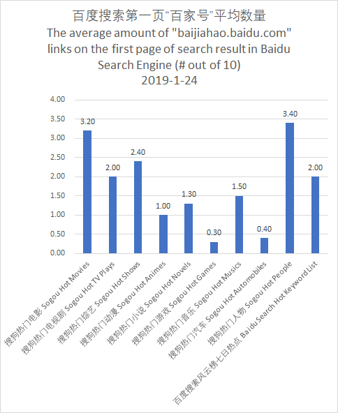

# Baidu Statistics

A simple Python 3 project to give some statistics information about [Baidu Search Engine](http://www.baidu.com), the 1st Search Engine in Mainland China.

Currently, it contains:

* Statistic of The average amount of Baijiahao (http://baijiahao.baidu.com) links on the first page of search result, mainly based on two keyword sources:
    * Sogou Hot Keyword List http://top.sogou.com
    * Baidu Hot Keyword List http://top.baidu.com/buzz?b=42&fr=topindex
    
## Figure

## License

MIT